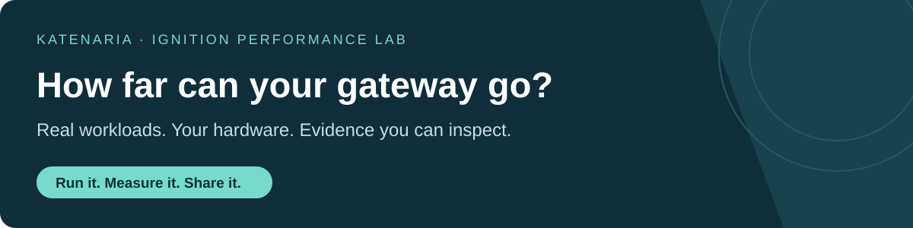

[](https://www.linkedin.com/company/katenaria/)
[](https://coprocessor.app)

**How much analytics can your Ignition gateway handle before it falls behind?**
Run the experiment on your own machine. Increase the inputs, watch the queue and
resource use, and discover the boundary for your workload. Real data, inspectable
code, and results you can reproduce.

Built by **[Katenaria](https://katenaria.com)** for Ignition system integrators.
Follow our experiments, share your findings, and help us test what comes next.

## Try the lab

With Docker Desktop running, [download this repository](https://github.com/rtbot-dev/ignition-performance-lab/archive/refs/heads/main.zip), extract it, and launch:

```sh
./lab.sh
```

**macOS:** double-click `Start Lab.command`. **Windows PowerShell:** `./lab.ps1`.
Accept the Ignition license when prompted. The launcher opens a local Ignition UI
with input controls and live queue, CPU and heap charts. No Designer or PLC needed.

## Pick an experiment

| Experiment | What you will discover |
|---|---|
| [**Jython vibration analytics →**](benchmarks/jython-vibration/) | Replay real bearing recordings and find when computation stops keeping up. |

Setup, methodology, dataset details and tested platforms live inside each experiment.

## What happens on your machine?

[**Share a reproduction**](https://github.com/rtbot-dev/ignition-performance-lab/issues/new?template=reproduction.md) · [**Suggest the next experiment**](https://github.com/rtbot-dev/ignition-performance-lab/issues/new) · [**Add a benchmark**](CONTRIBUTING.md)

**Want more analytics power inside Ignition?** We also build **Coprocessor**, a
C++ computation engine for Ignition. [Explore what it can do](https://coprocessor.app)
or [talk to us about your workload](mailto:services@katenaria.com).

<sub>This first benchmark runs Jython alone, without Coprocessor. Limits depend on workload and resources. [MIT license](LICENSE) · [Third-party notices](benchmarks/jython-vibration/NOTICE.md)</sub>
